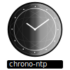

<!-- Improved compatibility of back to top link: See: https://github.com/othneildrew/Best-README-Template/pull/73 -->
<a name="readme-top"></a>

# chrono-ntp


## About the Project

<p align="center" width="100%">
  
</p>

chrono-ntp is a simple command-line tool that synchronizes with an NTP (Network Time Protocol) server to account for any difference between your computer’s clock and the actual time, displaying the precise date and time in your terminal.

You can use chrono-ntp to set your mechanical or digital watches or as a minimal distraction-free terminal clock.

## Getting Started

You can download the latest release from the [releases page on GitHub](https://github.com/ingk/chrono-ntp/releases).

Simply download the appropriate binary for your platform and follow the usage instructions.

### Installation via Homebrew

macOS or Linux users can use [Homebrew](https://brew.sh/) to install chrono-ntp.

```bash
brew tap ingk/chrono-ntp
brew install chrono-ntp
```

## Usage

Run chrono-ntp from your terminal:

```sh
chrono-ntp [options]
```

```
Usage of chrono-ntp:
  -server string
        NTP server to sync time from (default "time.google.com")
  -time-zone string
        Time zone name (e.g., 'America/New_York') (default "Local")
  -show-time-zone
        Show the time zone below time
  -time-format string
        Format for displaying time (ISO8601, 12h, 12h_AM_PM, .beat) (default "ISO8601")
  -hide-date
        Hide the current date
  -hide-statusbar
        Hide the status bar
  -beeps
        Play 6 beeps at the end of each minute, with the sixth beep at second 0 (emulates the Greenwich Time Signal)
  -offline
        Run in offline mode (use system time, ignore NTP server)
  -debug
        Show debug information (e.g. offset from NTP server), then exit
```

### Example

```sh
chrono-ntp -server time.google.com -time-zone Europe/Berlin
```


### Configuration File

chrono-ntp supports a configuration file for default values. You can create a TOML file at `~/.chrono-ntp.toml` to specify your preferred options, which will be loaded automatically on startup.

Example `~/.chrono-ntp.toml`:

```toml
server = "time.google.com"
time-zone = "Europe/Berlin"
show-time-zone = true
time-format = "ISO8601"
hide-date = false
hide-statusbar = false
beeps = true
```

Any command-line options will override the values set in the configuration file.

## Build from Source

To build chrono-ntp from source, you will need Go installed (version 1.18 or newer recommended).

Clone the repository, build, and run:

```sh
git clone https://github.com/ingk/chrono-ntp.git
cd chrono-ntp
make build
./chrono-ntp
```

## Contributing

Contributions are what make the open source community such an amazing place to learn, inspire, and create. Any contributions you make are **greatly appreciated**.

If you have a suggestion that would make this better, please fork the repo and create a pull request. You can also simply open an issue with the tag "enhancement".
Don't forget to give the project a star! Thanks again!

1. Fork the Project
2. Create your Feature Branch (`git checkout -b feature/AmazingFeature`)
3. Commit your Changes (`git commit -m 'Add some AmazingFeature'`)
4. Push to the Branch (`git push origin feature/AmazingFeature`)
5. Open a Pull Request

## License

This project is distributed under the MIT License. See `LICENSE.txt` for details.
